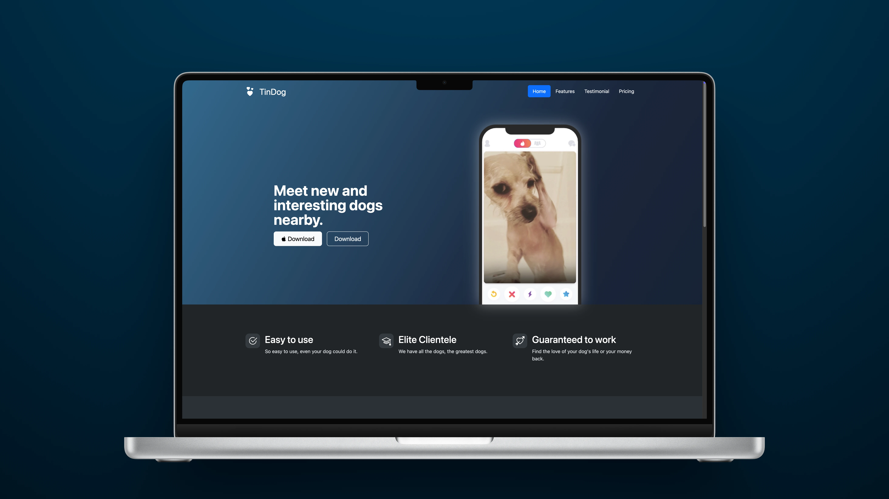

# TinDog

A responsive static website built with Bootstrap 5 that allows users to explore a Tinder-style platform for dogs.

<p align="center">
  
</p>

<br>

---

## Project Overview

TinDog is a fully responsive static website demonstrating front-end development skills using modern HTML, CSS, and Bootstrap 5.The project highlights the use of component-based design, responsive layouts, and practical styling for professional presentation.

This project demonstrates:

- Use of Bootstrap components: `Navbar`, `Buttons`, `Cards`, `Forms`, `Grid` `System`
- Responsive design compatible with mobile, tablet, and desktop
- Styling with **CSS3** and SVG icons
- Sectioned layouts: Features, Testimonials, Pricing, Footer
- Structuring a static HTML project for maintainability

<br>

---

## Requirements

Before running this project, ensure you have:

- A modern web browser (`Chrome`, `Firefox`, `Safari`, `Edge`)
- No backend or additional dependencies are required.

<br>

---

## Installation & Setup

1. Clone the repository:
   ```bash
   git clone https://github.com/MustafaHabibX/tindog.git
   ```
2. Navigate into the project folder:
   ```bash
   cd TinDog
   ```
3. Open index.html in your web browser.

(Optional: Use VS Code or any IDE to preview and edit the site.)
<br>

---

## Key Features

- Hero Section with call-to-action buttons
- Features Section highlighting app benefits with icons
- Testimonial Section with client feedback and logos
- Pricing Section with multiple plans and actionable buttons
- Responsive Footer with navigation, social links, and newsletter signup
- Entire layout built using Bootstrap utilities for clean, maintainable code

<br>

---

## Learning Outcomes

By completing this project, I got practical experience in:

- Developing a responsive static website using Bootstrap 5
- Implementing grids, cards, and components efficiently
- Applying CSS styling and SVG icons
- Structuring a clean, professional static project
- Designing a creative, user-friendly interface
- Producing a portfolio-ready front-end project

<br>
